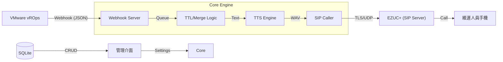

# 📞 vROps Alert AutoCaller

[](https://www.python.org/)
[](LICENSE)
[](https://www.vmware.com/products/vrealize-operations.html)
[](https://www.pjsip.org/)

**vROps Alert AutoCaller** 是一個專為企業 IT 運維設計的自動化告警解決方案。當 VMware vROps 偵測到虛擬機異常（如 CPU、RAM、Disk 壓力）時，系統會自動透過 SIP (EZUC+) 撥打電話給指定值班人員，並利用高畫質 TTS 技術播報詳細的中文語音告警。

---

## ✨ 核心特性

- **🚀 智慧型告警佇列 (v3)**：支援 Queue TTL 機制，自動捨棄過期告警，確保通知的及時性。
- **⛈️ 告警風暴合併 (v3)**：自動偵測爆發性告警，將多筆通知合併為一通摘要電話，避免通訊塞車與干擾。
- **🎙️ 多重 TTS 備援**：支援 Edge-TTS (高品質)、gTTS 與離線 pyttsx3，確保網路斷線時仍具備基礎播報能力。
- **🔐 安全防護**：Webhook 支援 Bearer Token 驗證；WebGUI 管理介面具備登入控管。
- **📍 進階路由引擎**：可根據虛擬機名稱、叢集或告警層級，自動將電話分流至不同的維運群組。
- **📊 視覺化管理**：內建 WebGUI，輕鬆管理聯絡人、群組、路由規則並即時查看撥號日誌。
- **🛠️ 企業級部署**：支援 Ubuntu systemd 服務啟動與 Docker 容器化部署。

---

## 🏗️ 系統架構



---

## 🚀 快速開始

### 1. 安裝與設定

```bash
git clone https://github.com/nchiyi/vrops-alert-autocaller.git
cd vrops-alert-autocaller

# 方法一：Ubuntu 原生安裝（推薦，含自動化交互設定）
sudo bash install.sh

# 方法二：Docker 容器化安裝
bash install.sh --docker
```

安裝腳本會自動處理：
- 系統依賴（ffmpeg, espeak-ng, pjsua2 編譯）。
- Python 虛擬環境與套件安裝。
- 產生 `settings.yaml` 與 `systemd` 服務檔。

### 2. vROps Webhook 設定

在 vROps 的 **Outbound Settings** 中建立新的 Webhook：
- **URL**: `http://YOUR_SERVER_IP:5000/vrops-webhook`
- **Header**: `Authorization: Bearer YOUR_WEBHOOK_TOKEN`
- **Method**: `POST`

---

## ⚙️ 設定檔說明

設定檔位於 `/opt/vrops-alert-caller/config/settings.yaml`。

| 參數區段 | 說明 |
| :--- | :--- |
| `webhook` | 設定監聽 Port 與驗證 Token |
| `tts` | 選擇語音引擎 (edge-tts/gtts) 與輸出的語音路徑 |
| `sip` | EZUC+ 伺服器資訊與帳號密碼 |
| `alert` | 設定去重視窗、重撥次數與風暴合併門檻 |

---

## 🖥️ 管理介面 (WebGUI)

預設登入網址：`http://YOUR_SERVER_IP:5000/`
- **預設帳號**: `admin`
- **預設密碼**: `changeme` (請務必於 settings.yaml 中修改)

---

## 📄 授權協議

本專案採用 [MIT License](LICENSE) 授權。

---
*Developed with ❤️ for IT Operations.*
