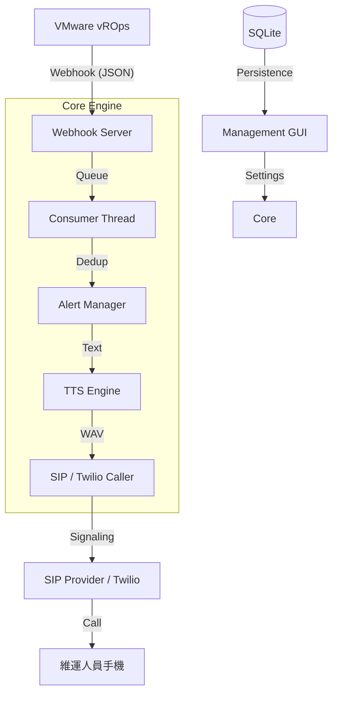

# 📞 vROps Alert AutoCaller

[](https://www.python.org/)
[](LICENSE)
[](https://www.vmware.com/products/vrealize-operations.html)
[](https://www.pjsip.org/)

**vROps Alert AutoCaller** 是一個專為企業 IT 運維設計的自動化告警解決方案。當 VMware vROps 偵測到虛擬機異常時，系統會自動透過 **標準 SIP Trunk (如 Twilio, EZUC+, FreePBX)** 或 **Twilio REST API** 撥打電話給值班人員，並利用高品質 TTS 技術播報詳細的中文語音告警。

---

## ✨ 核心特性

- **🚀 智慧型告警佇列**：內建 Queue TTL 與積壓管理機制，自動捨棄過期告警，確保通知具備即時時效性。
- **⛈️ 告警風暴合併**：自動偵測爆發性告警，將多筆通知合併為一通摘要電話，避免通訊塞車與維運人員疲勞。
- **🎙️ 多重 TTS 備援**：整合 Edge-TTS (高品質雲端語音)、gTTS 與離線 pyttsx3，並具備靜態 WAV 降級機制，確保網路不穩時仍能響鈴。
- **🔐 企業級安全性**：Webhook 支援 Bearer Token 驗證；WebGUI 使用 Session 控管並支援 SSL/TLS 自動化部署。
- **📍 進階路由引擎**：可根據虛擬機名稱、資源標籤或告警層級，精確將通報路由至不同的維運群組。
- **📊 全方位 WebGUI**：視覺化管理聯絡人、群組、路由規則，並提供即時通話日誌與路由測試器。

---

## 🏗️ 系統架構



---

## 🚀 快速開始

### 1. 安裝與部署

```bash
git clone https://github.com/nchiyi/vrops-alert-autocaller.git
cd vrops-alert-autocaller

# 執行互動式安裝腳本（推薦）
sudo bash install.sh
```

安裝腳本會引導您完成：
- 系統環境檢查與依賴安裝（ffmpeg, pjsua2 等）。
- 自訂管理員帳號與密碼。
- 自動產生 `settings.yaml` 與 `systemd` 服務配置。
- 選配 Nginx 反向代理與 Let's Encrypt SSL 憑證。

### 2. vROps Webhook 設定

在 vROps 的 **Outbound Settings** 中建立 Webhook 插件：
- **URL**: `https://YOUR_DOMAIN_OR_IP/vrops-webhook`
- **Header**: `Authorization: Bearer YOUR_WEBHOOK_TOKEN`
- **Method**: `POST`

---

## ⚙️ 設定管理

系統設定位於 `config/settings.yaml`，由於包含敏感資訊，該檔案不會被 Git 追蹤。

| 模組 | 說明 |
| :--- | :--- |
| **Webhook** | 定義驗證 Token 與監聽端口 |
| **SIP / Twilio** | 配置電信提供商憑證、伺服器資訊與傳輸協定 (TLS/UDP) |
| **Alert** | 管理去重視窗、重試次數與升級機制 (Escalation) |
| **WebGUI** | 管理介面權限與管理員帳號配置 |

---

## 🖥️ 管理介面 (WebGUI)

預設存取位址：`http://YOUR_SERVER_IP:5000/` (建議透過 Nginx 啟用 HTTPS)
- **帳號密碼**: 於安裝階段 (install.sh) 自行設定。
- **功能**: 即時儀表板、聯絡人管理、路由規則測試、通話歷史回放。

---

## 📄 授權協議

本專案採用 [MIT License](LICENSE) 授權。

---
*Developed with ❤️ for Modern IT Operations.*
